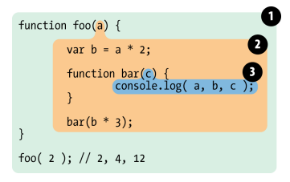

# Concepts

* [lexical scope](#lexical-scope)
* [Hoisting](#hoisting)

---

# Lexical Scope

There are two predominant models for how scope works. The first of these is by far the most common, used by the vast majority of                    programming languages. It's called lexical scope, and we will examine it in depth. The other model, which is still used by some languages               (such as Bash scripting, some modes in Perl, etc) is called dynamic scope.

the first traditional phase of a standard language compiler is called lexing (a.k.a., tokenizing). If you recall, the lexing process examines a string of source code characters and assigns semantic meaning to the tokens as a result of some stateful parsing.It is this concept that provides the foundation to understand what lexical scope is and where the name comes from. To define it somewhat circularly, lexical scope is scope that is defined at lexing time. In other words, lexical scope is based on where variables and blocks of scope are authored, by you, at write time, and thus is
(mostly) set in stone by the time the lexer processes your code.

```javascript
function foo(a) {
 var b = a * 2;
 function bar(c) {
 console.log( a, b, c );
 }
 bar( b * 3 );
}
foo( 2 ); // 2, 4, 12
```

the above code scoping represent as



In general the scope are classified in to three categories.

1. block scope
2. function scope
3. globla scope

## Block Scope

Before ES6 (2015), JavaScript had only **Global Scope** and  **Function Scope** .

ES6 introduced two important new JavaScript keywords: `let` and `const`.

These two keywords provide **Block Scope** in JavaScript.

Variables declared inside a { } block cannot be accessed from outside the block:

```javascript
{
  let x = 2;
}
// x can NOT be used here
```

Note:

Variables declared with the `var` keyword can NOT have block scope.

Variables declared inside a { } block can be accessed from outside the block.

## Function Scope

JavaScript has function scope: Each function creates a new scope.

Variables defined inside a function are not accessible (visible) from outside the function.

Variables declared with `var`, `let` and `const` are quite similar when declared inside a function.

They all have  **Function Scope** :

```javascript
function myFunction() {
  var carName = "Volvo";   // Function Scope
}
function myFunction() {
  let carName = "Volvo";   // Function Scope
}
function myFunction() {
  const carName = "Volvo";   // Function Scope
}
```

## Global JavaScript Variables

A variable declared outside a function, becomes  **GLOBAL** .

Variables declared **Globally** (outside any function) have  **Global Scope** .

**Global** variables can be accessed from anywhere in a JavaScript program.

Variables declared with `var`, `let` and `const` are quite similar when declared outside a block.

```javascript
let carName = "Volvo";
// code here can use carName

function myFunction() {
// code here can also use carName
}
```

# Hoisting

There's a temptation to think that all of the code you see in a JavaScript program is interpreted line-by-line, top-down in order, as the program
executes. While that is substantially true, there's one part of that assumption that can lead to incorrect thinking about your program.
Consider this code:

```javascript
a = 2;
var a;
console.log( a );
```

What do you expect to be printed in the console.log(..) statement? Many developers would expect undefined, since the var a statement
comes after the a = 2, and it would seem natural to assume that the variable is redefined, and thus assigned the default undefined. How‐
ever, the output will be 2.
Consider another piece of code:

```javascript
console.log( a );
var a = 2;
```

You might be tempted to assume that, since the previous snippet exhibited some less-than-top-down looking behavior, perhaps in this
snippet, 2 will also be printed. Others may think that since the a variable is used before it is declared, this must result in a                          ReferenceError being thrown. Unfortunately, both guesses are incorrect. undefined is the output.

Recall that the engine actually will compile your JavaScript code before it interprets it. Part of the compilation phase was to find and associate all declarations with their appropriate scopes.

So, the best way to think about things is that all declarations, both variables and functions, are processed first, before any part of your
code is executed.  When you see var a = 2;, you probably think of that as one statement. But JavaScript actually thinks of it as two statements: 

var a; and a =2;. The first statement, the declaration, is processed during the compilation phase. The second statement, the assignment, is left in place for the execution phase.Our first snippet then should be thought of as being handled like this:

```javascript
var a;
a = 2;
console.log( a );
```

Similarly, our second snippet is actually processed as:

```javascript
var a;
console.log( a );
a = 2;
```

Note:

Only the declarations themselves are hoisted, while any assignments or other executable logic are left in place

Both function declarations and variable declarations are hoisted. But a subtle detail (that can show up in code with multiple “duplicate”
declarations) is that functions are hoisted first, and then variables.

## What is the Execution Context?

When the JavaScript engine scans a script file, it makes an environment called the **Execution Context **that handles the entire transformation and execution of the code.

During the context runtime, the parser parses the source code and allocates memory for the variables and functions. The source code is generated and gets executed.

There are two types of execution contexts: **global** and  **function** . The global execution context is created when a JavaScript script first starts to run, and it represents the global scope in JavaScript. A function execution context is created whenever a function is called, representing the function's local scope.

### Phases of the JavaScript Execution Context

There are two phases of JavaScript execution context:

1. **Creation phase** : In this phase, the JavaScript engine creates the execution context and sets up the script's environment. It determines the values of variables and functions and sets up the scope chain for the execution context.
2. **Execution phase** : In this phase, the JavaScript engine executes the code in the execution context. It processes any statements or expressions in the script and evaluates any function calls.

Everything in JS happens inside this execution context. It is divided into two components. One is memory and the other is code. It is important to remember that these phases and components are applicable to both global and functional execution contexts.


Let's take this simple example once again:

```javascript
var n = 5;

function square(n) {
  var ans = n * n;
  return ans;
}

var square1 = square(n);
var square2 = square(8);  

console.log(square1)
console.log(square2)
```

At the very beginning, the JavaScript engine executes the entire source code, creates a global execution context, and then does the following things:

1. Creates a global object that is** window** in the browser and **global** in NodeJs.
2. Sets up a memory for storing variables and functions.
3. Stores the variables with values as undefined and function references.

This is called the creation phase. Here's a diagram to help explain it:


After this creation phase, the execution context will move to the code execution phase.

### Execution Phase

Now, in this phase, it starts going through the entire code line by line from top to bottom. As soon as it encounters  **n = 5** , it assigns the value 5 to 'n' in memory. Until now, the value of 'n' was undefined by default.

Then we get to the 'square' function. As the function has been allocated in memory, it directly jumps into the line  **var square1 = square(n);** . square() will be invoked and JavaScript once again will create a new function execution context.


Once the calculation is done, it assigns the value of square in the 'ans' variable that was undefined before. The function will return the value, and the function execution context will be destroyed.

The returned value from square() will be assigned on square1. This happens for square2 also. Once the entire code execution is done completely, the global context will look like this and it will be destroyed also.


## What is the Call Stack?

To keep the track of all the contexts, including global and functional, the JavaScript engine uses a  **call stack** . A call stack is also known as an 'Execution Context Stack', 'Runtime Stack', or 'Machine Stack'.

It uses the LIFO principle (Last-In-First-Out). When the engine first starts executing the script, it creates a global context and pushes it on the stack. Whenever a function is invoked, similarly, the JS engine creates a function stack context for the function and pushes it to the top of the call stack and starts executing it.

When execution of the current function is complete, then the JavaScript engine will automatically remove the context from the call stack and it goes back to its parent.

Let's see the following example:

```javascript
function funcA(m,n) {
    return m * n;
}

function funcB(m,n) {
    return funcA(m,n);
}

function getResult(num1, num2) {
    return funcB(num1, num2)
}

var res = getResult(5,6);

console.log(res); // 30
```

In this example, the JS engine creates a global execution context that enters the creation phase.

First it allocates memory for `funcA`, `funcB`, the `getResult` function, and the `res` variable. Then it invokes `getResult()`, which will be pushed on the call stack.

Then `getResult()` will call `funcB()`. At this point, `funcB`'s context will be stored on the top of the stack. Then it will start executing and call another function `funcA()`. Similarly, `funcA`'s context will be pushed.

Once execution of each function is done, it will be removed from the call stack. The following picture depicts the entire process of the execution:


The call stack has its own fixed size depending on the system or browser. If the number of contexts exceeds the limit, then a stack overflow error will occur. This happens with a recursive function that has no base condition.
