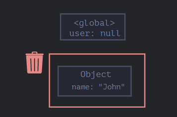
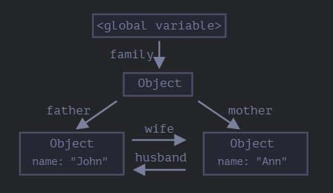
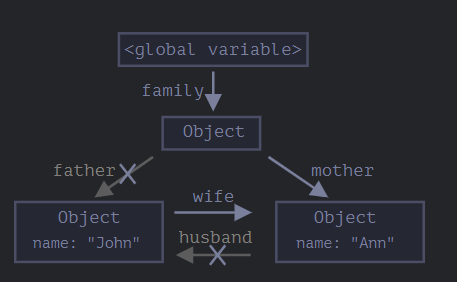
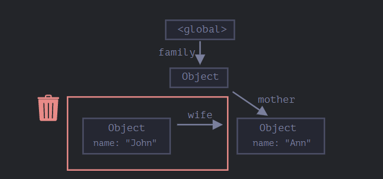
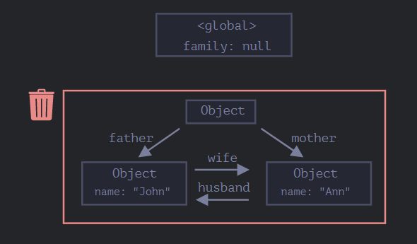

# Concepts:

* [Objects](#objects)
* call,apply,bind
* classes
* prototype

# Objects:

 objects are used to store keyed collections of various data and more complex entities. In JavaScript, objects penetrate almost every aspect of the language. So we must understand them first before going in-depth anywhere else.

An object can be created with figure brackets `{…}` with an optional list of  *properties* . A property is a “key: value” pair, where `key` is a string (also called a “property name”), and `value` can be anything.

We can imagine an object as a cabinet with signed files. Every piece of data is stored in its file by the key. It’s easy to find a file by its name or add/remove a file.

An empty object (“empty cabinet”) can be created using one of two syntaxes:

```javascript
let user = new Object(); // "object constructor" syntax
let user = {};  // "object literal" syntax
```

## Literals and properties

We can immediately put some properties into `{...}` as “key: value” pairs:

```javascript
let user = {     // an object
  name: "John",  // by key "name" store value "John"
  age: 30        // by key "age" store value 30
};
```

A property has a key (also known as “name” or “identifier”) before the colon `":"` and a value to the right of it.

In the `user` object, there are two properties:

1. The first property has the name `"name"` and the value `"John"`.
2. The second one has the name `"age"` and the value `30`.

The resulting `user` object can be imagined as a cabinet with two signed files labeled “name” and “age”.

We can add, remove and read files from it at any time.

```javascript
// get property values of the object:
console.log( user.name ); // John
console.log( user.age ); // 30
```

Property values are accessible using the dot notation:

```javascript
user.isAdmin = true;
```

The value can be of any type. Let’s add a boolean one:

To remove a property, we can use the `delete` operator:

```javascript
delete user.age;
```

We can also use multiword property names, but then they must be quoted:

```javascript
let user = {
  name: "John",
  age: 30,
  "likes birds": true  // multiword property name must be quoted
};
```

The last property in the list may end with a comma:

```javascript
let user = {
  name: "John",
  age: 30,
}
```

That is called a “trailing” or “hanging” comma. Makes it easier to add/remove/move around properties, because all lines become alike.

## Square brackets

For multiword properties, the dot access doesn’t work:

```javascript
// this would give a syntax error
user.likes birds = true
```

JavaScript doesn’t understand that. It thinks that we address `user.likes`, and then gives a syntax error when comes across unexpected `birds`.

The dot requires the key to be a valid variable identifier. That implies: contains no spaces, doesn’t start with a digit and doesn’t include special characters (`$` and `_` are allowed).

There’s an alternative “square bracket notation” that works with any string:

```javascript
let user = {};

// set
user["likes birds"] = true;

// get
alert(user["likes birds"]); // true

// delete
delete user["likes birds"];
```

Now everything is fine. Please note that the string inside the brackets is properly quoted (any type of quotes will do).

Square brackets also provide a way to obtain the property name as the result of any expression – as opposed to a literal string – like from a variable as follows:

```javascript
let key = "likes birds";

// same as user["likes birds"] = true;
user[key] = true;
```

Here, the variable `key` may be calculated at run-time or depend on the user input. And then we use it to access the property. That gives us a great deal of flexibility.

For instance:

```javascript
let user = {
  name: "John",
  age: 30
};

let key = prompt("What do you want to know about the user?", "name");

// access by variable
alert( user[key] ); // John (if enter "name")
```

```javascript
let user = {
  name: "John",
  age: 30
};

let key = "name";
alert( user.key ) // undefined
```

Computed properties

We can use square brackets in an object literal, when creating an object. That’s called  *computed properties* .

For instance:

```javascript
let fruit = prompt("Which fruit to buy?", "apple");

let bag = {
  [fruit]: 5, // the name of the property is taken from the variable fruit
};

alert( bag.apple ); // 5 if fruit="apple"
```

The meaning of a computed property is simple: `[fruit]` means that the property name should be taken from `fruit`.

So, if a visitor enters `"apple"`, `bag` will become `{apple: 5}`.

Essentially, that works the same as:

```javascript
let fruit = prompt("Which fruit to buy?", "apple");
let bag = {};

// take property name from the fruit variable
bag[fruit] = 5;
```

…But looks nicer.

We can use more complex expressions inside square brackets:

```javascript
let fruit = 'apple';
let bag = {
  [fruit + 'Computers']: 5 // bag.appleComputers = 5
};
```

Square brackets are much more powerful than dot notation. They allow any property names and variables. But they are also more cumbersome to write.

So most of the time, when property names are known and simple, the dot is used. And if we need something more complex, then we switch to square brackets.

## Property value shorthand

In real code, we often use existing variables as values for property names.

For instance:

```javascript
function makeUser(name, age) {
  return {
    name: name,
    age: age,
    // ...other properties
  };
}

let user = makeUser("John", 30);
alert(user.name); // John
```

In the example above, properties have the same names as variables. The use-case of making a property from a variable is so common, that there’s a special *property value shorthand* to make it shorter.

Instead of `name:name` we can just write `name`, like this:

```javascript
function makeUser(name, age) {
  return {
    name, // same as name: name
    age,  // same as age: age
    // ...
  };
}
```

## Property names limitations

As we already know, a variable cannot have a name equal to one of the language-reserved words like “for”, “let”, “return” etc.

But for an object property, there’s no such restriction:

```javascript
// these properties are all right
let obj = {
  for: 1,
  let: 2,
  return: 3
};

alert( obj.for + obj.let + obj.return );  // 6
```

In short, there are no limitations on property names. They can be any strings or symbols (a special type for identifiers, to be covered later).

Other types are automatically converted to strings.

For instance, a number `0` becomes a string `"0"` when used as a property key:

```javascript
let obj = {
  0: "test" // same as "0": "test"
};

// both alerts access the same property (the number 0 is converted to string "0")
alert( obj["0"] ); // test
alert( obj[0] ); // test (same property)
```

There’s a minor gotcha with a special property named `__proto__`. We can’t set it to a non-object value:

```javascript
let obj = {};
obj.__proto__ = 5; // assign a number
alert(obj.__proto__); // [object Object] - the value is an object, didn't work as intended
```

As we see from the code, the assignment to a primitive `5` is ignored.(the concept told in prototypes)

## Property existence test, “in” operator

A notable feature of objects in JavaScript, compared to many other languages, is that it’s possible to access any property. There will be no error if the property doesn’t exist!

Reading a non-existing property just returns `undefined`. So we can easily test whether the property exists:

```javascript
let user = {};

alert( user.noSuchProperty === undefined ); // true means "no such property"
```

There’s also a special operator `"in"` for that.

The syntax is:

```javascript
let user = { name: "John", age: 30 };

alert( "age" in user ); // true, user.age exists
alert( "blabla" in user ); // false, user.blabla doesn't exist
```

Please note that on the left side of `in` there must be a  *property name* . That’s usually a quoted string.

If we omit quotes, that means a variable should contain the actual name to be tested. For instance:

```javascript
let user = { age: 30 };

let key = "age";
alert( key in user ); // true, property "age" exists
```

Why does the `in` operator exist? Isn’t it enough to compare against `undefined`?

Well, most of the time the comparison with `undefined` works fine. But there’s a special case when it fails, but `"in"` works correctly.

It’s when an object property exists, but stores `undefined`:

```javascript
let obj = {
    test: undefined
  };
  
  console.log( obj.test ); // it's undefined, so - no such property?
  
  console.log( "test" in obj );
```

In the code above, the property `obj.test` technically exists. So the `in` operator works right.

Situations like this happen very rarely, because `undefined` should not be explicitly assigned. We mostly use `null` for “unknown” or “empty” values. So the `in` operator is an exotic guest in the code.

## The for..in loop

To walk over all keys of an object, there exists a special form of the loop: `for..in`. This is a completely different thing from the `for(;;)` construct that we studied before.

The syntax:

```javascript
for (key in object) {
  // executes the body for each key among object properties
}
```

For instance, let’s output all properties of `user`:

```javascript
let user = {
  name: "John",
  age: 30,
  isAdmin: true
};

for (let key in user) {
  // keys
  alert( key );  // name, age, isAdmin
  // values for the keys
  alert( user[key] ); // John, 30, true
}
```

Note that all “for” constructs allow us to declare the looping variable inside the loop, like `let key` here.

Also, we could use another variable name here instead of `key`. For instance, `"for (let prop in obj)"` is also widely used.

## Ordered like an object

Are objects ordered? In other words, if we loop over an object, do we get all properties in the same order they were added? Can we rely on this?

The short answer is: “ordered in a special fashion”: integer properties are sorted, others appear in creation order. The details follow.

As an example, let’s consider an object with the phone codes:

```javascript
let codes = {
  "49": "Germany",
  "41": "Switzerland",
  "44": "Great Britain",
  // ..,
  "1": "USA"
};

for (let code in codes) {
  alert(code); // 1, 41, 44, 49
}
```

The object may be used to suggest a list of options to the user. If we’re making a site mainly for a German audience then we probably want `49` to be the first.

But if we run the code, we see a totally different picture:

* USA (1) goes first
* then Switzerland (41) and so on.

The phone codes go in the ascending sorted order, because they are integers. So we see `1, 41, 44, 49`.

```javascript
let obj = {
    test: undefined,
    demo:1,
    "1":"HELLO",
    "41":"nothing",
    "44":"demo nothing",
    5:"demothing",

  };
  
for (let i in obj){
    console.log(obj[i])
}
/*
HELLO
demothing
nothing
demo nothing
undefined
1
*/ 
```

…On the other hand, if the keys are non-integer, then they are listed in the creation order, for instance:

So, to fix the issue with the phone codes, we can “cheat” by making the codes non-integer. Adding a plus `"+"` sign before each code is enough.

Like this:

```javascript
let codes = {
  "+49": "Germany",
  "+41": "Switzerland",
  "+44": "Great Britain",
  // ..,
  "+1": "USA"
};

for (let code in codes) {
  alert( +code ); // 49, 41, 44, 1
}
```

# Object references and copying

One of the fundamental differences of objects versus primitives is that objects are stored and copied “by reference”, whereas primitive values: strings, numbers, booleans, etc – are always copied “as a whole value”.

That’s easy to understand if we look a bit under the hood of what happens when we copy a value.

Let’s start with a primitive, such as a string.

Here we put a copy of `message` into `phrase`:

```javascript
let message = "Hello!";
let phrase = message;
```

As a result we have two independent variables, each one storing the string `"Hello!"`.

Quite an obvious result, right?

Objects are not like that.

**A variable assigned to an object stores not the object itself, but its “address in memory” – in other words “a reference” to it.**

Let’s look at an example of such a variable:

```javascript
let user = {
  name: "John"
};
```

The object is stored somewhere in memory (at the right of the picture), while the `user` variable (at the left) has a “reference” to it.

We may think of an object variable, such as `user`, like a sheet of paper with the address of the object on it.

When we perform actions with the object, e.g. take a property `user.name`, the JavaScript engine looks at what’s at that address and performs the operation on the actual object.

Now here’s why it’s important.

**When an object variable is copied, the reference is copied, but the object itself is not duplicated.**

For instance:

```javascript
let user = { name: "John" };

let admin = user; // copy the reference
```

Now we have two variables, each storing a reference to the same object:

As you can see, there’s still one object, but now with two variables that reference it.

We can use either variable to access the object and modify its contents:

```javascript
let user = { name: 'John' };

let admin = user;

admin.name = 'Pete'; // changed by the "admin" reference

console.log(user.name); // 'Pete', changes are seen from the "user" reference
```

It’s as if we had a cabinet with two keys and used one of them (`admin`) to get into it and make changes. Then, if we later use another key (`user`), we are still opening the same cabinet and can access the changed contents.

## Comparison by reference

Two objects are equal only if they are the same object.

For instance, here `a` and `b` reference the same object, thus they are equal:

```javascript
let a = {};
let b = a; // copy the reference

console.log( a == b ); // true, both variables reference the same object
console.log( a === b ); // true
```

And here two independent objects are not equal, even though they look alike (both are empty):

```javascript
let a = {};
let b = {}; // two independent objects

console.log( a == b ); // false
console.log(a===b);//false
```

For comparisons like `obj1 > obj2` or for a comparison against a primitive `obj == 5`, objects are converted to primitives. We’ll study how object conversions work very soon, but to tell the truth, such comparisons are needed very rarely – usually they appear as a result of a programming mistake.

An important side effect of storing objects as references is that an object declared as `const` *can* be modified.

```javascript
const user = {
  name: "John"
};

user.name = "Pete"; // (*)

alert(user.name); // Pete
```

It might seem that the line `(*)` would cause an error, but it does not. The value of `user` is constant, it must always reference the same object, but properties of that object are free to change.

In other words, the `const user` gives an error only if we try to set `user=...` as a whole.

## Cloning and merging, Object.assign

So, copying an object variable creates one more reference to the same object.

But what if we need to duplicate an object?

We can create a new object and replicate the structure of the existing one, by iterating over its properties and copying them on the primitive level.

Like this:

```javascript
let user = {
  name: "John",
  age: 30
};

let clone = {}; // the new empty object

// let's copy all user properties into it
for (let key in user) {
  clone[key] = user[key];
}

// now clone is a fully independent object with the same content
clone.name = "Pete"; // changed the data in it

console.log( user.name ); // still John in the original object
```

We can also use the method [Object.assign](https://developer.mozilla.org/en-US/docs/Web/JavaScript/Reference/Global_Objects/Object/assign).

The syntax is:

```javascript
Object.assign(dest, ...sources)
```

* The first argument `dest` is a target object.
* Further arguments is a list of source objects.

It copies the properties of all source objects into the target `dest`, and then returns it as the result.

For example, we have `user` object, let’s add a couple of permissions to it:

```javascript
Object.assign(dest, ...sources)let user = { name: "John" };

let permissions1 = { canView: true };
let permissions2 = { canEdit: true };

// copies all properties from permissions1 and permissions2 into user
Object.assign(user, permissions1, permissions2);

// now user = { name: "John", canView: true, canEdit: true }
console.log(user.name); // John
console.log(user.canView); // true
console.log(user.canEdit); // true
```

If the copied property name already exists, it gets overwritten:

```javascript
let user = { name: "John" };

Object.assign(user, { name: "Pete" });

console.log(user.name); // now user = { name: "Pete" }
```

We also can use `Object.assign` to perform a simple object cloning:

```javascript
let user = {
  name: "John",
  age: 30
};

let clone = Object.assign({}, user);

console.log(clone.name); // John
console.log(clone.age); // 30
```


Here it copies all properties of `user` into the empty object and returns it.

There are also other methods of cloning an object, e.g. using the [spread syntax](https://javascript.info/rest-parameters-spread) `clone = {...user}`, covered later in the tutorial.

## Nested cloning

Until now we assumed that all properties of `user` are primitive. But properties can be references to other objects.

Like this:

```javascript
let user = {
  name: "John",
  sizes: {
    height: 182,
    width: 50
  }
};

console.log( user.sizes.height ); // 182
```

Now it’s not enough to copy `clone.sizes = user.sizes`, because `user.sizes` is an object, and will be copied by reference, so `clone` and `user` will share the same sizes:

```javascript
let user = {
  name: "John",
  sizes: {
    height: 182,
    width: 50
  }
};

let clone = Object.assign({}, user);

console.log( user.sizes === clone.sizes ); // true, same object

// user and clone share sizes
user.sizes.width = 60;    // change a property from one place
console.log(clone.sizes.width); // 60, get the result from the other one
```

To fix that and make `user` and `clone` truly separate objects, we should use a cloning loop that examines each value of `user[key]` and, if it’s an object, then replicate its structure as well. That is called a “deep cloning” or “structured cloning”. There’s [structuredClone](https://developer.mozilla.org/en-US/docs/Web/API/structuredClone) method that implements deep cloning.

### structuredClone

The call `structuredClone(object)` clones the `object` with all nested properties.

Here’s how we can use it in our example:

```javascript
let user = {
  name: "John",
  sizes: {
    height: 182,
    width: 50
  }
};

let clone = structuredClone(user);

console.log( user.sizes === clone.sizes ); // false, different objects

// user and clone are totally unrelated now
user.sizes.width = 60;    // change a property from one place
console.log(clone.sizes.width); // 50, not related
```

The `structuredClone` method can clone most data types, such as objects, arrays, primitive values.

It also supports circular references, when an object property references the object itself (directly or via a chain or references).

For instance:

```javascript
let user = {};
// let's create a circular reference:
// user.me references the user itself
user.me = user;

let clone = structuredClone(user);
console.log(clone.me === clone); // true
```

As you can see, `clone.me` references the `clone`, not the `user`! So the circular reference was cloned correctly as well.

Although, there are cases when `structuredClone` fails.

For instance, when an object has a function property:

```javascript
// error
structuredClone({
  f: function() {}
});
```


Function properties aren’t supported.

To handle such complex cases we may need to use a combination of cloning methods, write custom code or, to not reinvent the wheel, take an existing implementation, for instance [_.cloneDeep(obj)](https://lodash.com/docs#cloneDeep) from the JavaScript library [lodash](https://lodash.com/).

# Garbage collection

Memory management in JavaScript is performed automatically and invisibly to us. We create primitives, objects, functions… All that takes memory.

What happens when something is not needed any more? How does the JavaScript engine discover it and clean it up?

## Reachability

The main concept of memory management in JavaScript is  *reachability* .

Simply put, “reachable” values are those that are accessible or usable somehow. They are guaranteed to be stored in memory.

1. There’s a base set of inherently reachable values, that cannot be deleted for obvious reasons.
   For instance:

   * The currently executing function, its local variables and parameters.
   * Other functions on the current chain of nested calls, their local variables and parameters.
   * Global variables.
   * (there are some other, internal ones as well)

   These values are called  *roots* .
2. Any other value is considered reachable if it’s reachable from a root by a reference or by a chain of references.
   For instance, if there’s an object in a global variable, and that object has a property referencing another object, *that* object is considered reachable. And those that it references are also reachable. Detailed examples to follow.

There’s a background process in the JavaScript engine that is called [garbage collector](https://en.wikipedia.org/wiki/Garbage_collection_(computer_science)). It monitors all objects and removes those that have become unreachable.

## A simple example

Here’s the simplest example:

```javascript
// user has a reference to the object
let user = {
  name: "John"
};
```

The global variable `"user"` references the object `{name: "John"}` (we’ll call it John for brevity). The `"name"` property of John stores a primitive, so it’s painted inside the object.

If the value of `user` is overwritten, the reference is lost:

```javascript
user = null;
```



Now John becomes unreachable. There’s no way to access it, no references to it. Garbage collector will junk the data and free the memory.

## Two references

Now let’s imagine we copied the reference from `user` to `admin`:

```javascript
// user has a reference to the object
let user = {
  name: "John"
};

let admin = user;
```

Now if we do the same:

```javascript
user=null
```

…Then the object is still reachable via `admin` global variable, so it must stay in memory. If we overwrite `admin` too, then it can be removed.

here we are not modifying the object even though adimin set to null it can be accessed by the user.

## Interlinked objects

Now a more complex example. The family:

```javascript
function marry(man, woman) {
  woman.husband = man;
  man.wife = woman;

  return {
    father: man,
    mother: woman
  }
}

let family = marry({
  name: "John"
}, {
  name: "Ann"
});
```

Function `marry` “marries” two objects by giving them references to each other and returns a new object that contains them both.

The resulting memory structure:



As of now, all objects are reachable.

Now let’s remove two references:

```javascript
delete family.father;
delete family.mother.husband;
```



It’s not enough to delete only one of these two references, because all objects would still be reachable.

But if we delete both, then we can see that John has no incoming reference any more:



Outgoing references do not matter. Only incoming ones can make an object reachable. So, John is now unreachable and will be removed from the memory with all its data that also became unaccessible.

## Unreachable island

It is possible that the whole island of interlinked objects becomes unreachable and is removed from the memory.

The source object is the same as above. Then:

```javascript
family = null;
```

The in-memory picture becomes:



This example demonstrates how important the concept of reachability is.

It’s obvious that John and Ann are still linked, both have incoming references. But that’s not enough.

The former `"family"` object has been unlinked from the root, there’s no reference to it any more, so the whole island becomes unreachable and will be removed.
